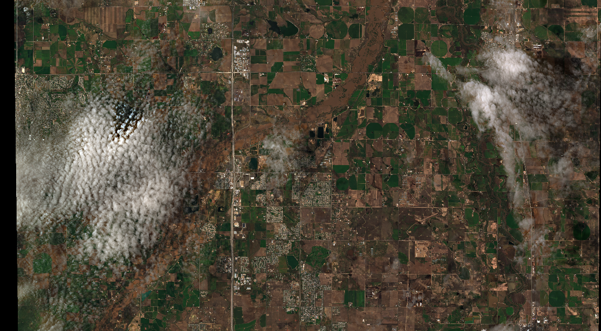

# flood-mapper

A GBDX task that maps flood water on 4-band or 8-band atmospherically compensated DigitalGlobe imagery.

The algorithm employs a pixel-based, generic material discriminator that produces an estimate for each pixel being member of a water-saturated body.

The task produces a mask where white corresponds to flood water and black to the background (see example below).

  

  

## Run

In a Python terminal:

```python
import gbdxtools

gbdx = gbdxtools.Interface()

fm = gbdx.Task('flood-mapper')
fm.inputs.image = 's3://gbd-customer-data/32cbab7a-4307-40c8-bb31-e2de32f940c2/platform-stories/flood-water/north-carolina/10400100238BDE00/ms'

# Run workflow and save results
wf = gbdx.Workflow([fm])
wf.savedata(fm.outputs.image, 'platform-stories/trial-runs/flood-water')
wf.execute()
```

## Input ports

| Name  | Type |  Description | Required |
|-------|--------------|----------------|----------------|
| image | directory | Contains input image. The input image must be a 4/8-band atmospherically-compensated multispectral image. If more than one images are contained in this directory, one is picked arbitrarily. | True |
| tolerance | string | A percentage value. High tolerance picks up everything with a detectable concentration of moisture or surface water. Intermediate tolerance picks up water-saturated soils and other materials. Low tolerance picks up only impure water bodies. Default is 50. | False |
| min_size | string | Minimum target area in m2. Default is 1000. | False |
| min_width | string | Minimum target width in m2. Default is 10. | False |
| confidence | string | Minimum confidence to determine flood water pixel. Default is 15. | False |

## Output ports

| Name  | Type | Description                                    |
|-------|---------|---------------------------------------------------|
| image | directory | Contains output mask. |


## Development

### Build the Docker image

You need to install [Docker](https://docs.docker.com/engine/installation/).

Clone the repository:

```bash
git clone https://github.com/platformstories/flood-mapper
```

Then:

```bash
cd flood-mapper
docker build --build-arg PROTOUSER=<GitHub username> \
             --build-arg PROTOPASSWORD=<GitHub password> \
             -t flood-mapper .
```

### Try out locally

Create a container in interactive mode and mount the sample input under `/mnt/work/input/`:

```bash
docker run -v full/path/to/sample-input:/mnt/work/input -it flood-mapper
```

Then, within the container:

```bash
python /flood-mapper.py
```

Confirm that the output image is under `/mnt/work/output/image`.

### Docker Hub

Login to Docker Hub:

```bash
docker login
```

Tag your image using your username and push it to DockerHub:

```bash
docker tag flood-mapper yourusername/flood-mapper
docker push yourusername/flood-mapper
```

The image name should be the same as the image name under containerDescriptors in flood-mapper.json.

Alternatively, you can link this repository to a [Docker automated build](https://docs.docker.com/docker-hub/builds/).
Every time you push a change to the repository, the Docker image gets automatically updated.

### Register on GBDX

In a Python terminal:

```python
import gbdxtools
gbdx = gbdxtools.Interface()
gbdx.task_registry.register(json_filename='flood-mapper.json')
```

Note: If you change the task image, you need to reregister the task with a higher version number
in order for the new image to take effect. Keep this in mind especially if you use Docker automated build.
